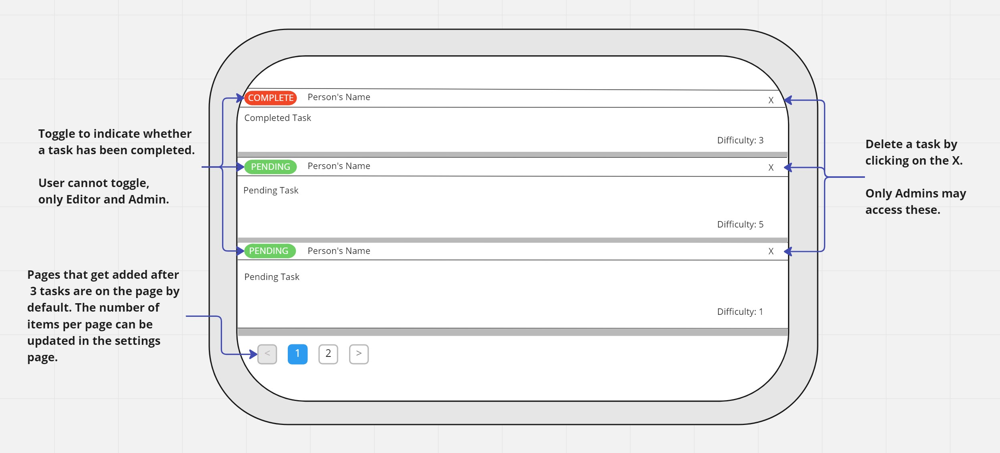

# todo-app

## Author: Trace Dugar

## Collaborators

- Hunter Fehr
- Kenny Lino

## Links and Resources

- [Github Repo](https://github.com/TraceDugar/todo-app)

- [Live Deployment](https://todo-app-traced.onrender.com)

### Running Applications

- `npm start`

#### Features and Routes

- Feature 1: Once a page has 3 items a new page is generated via Pagination.
- Feature 2: Settings page added, with settings that are persisted in local storage.

#### Tests

- tests are ran with Jest
- tests list and app components

#### UML

