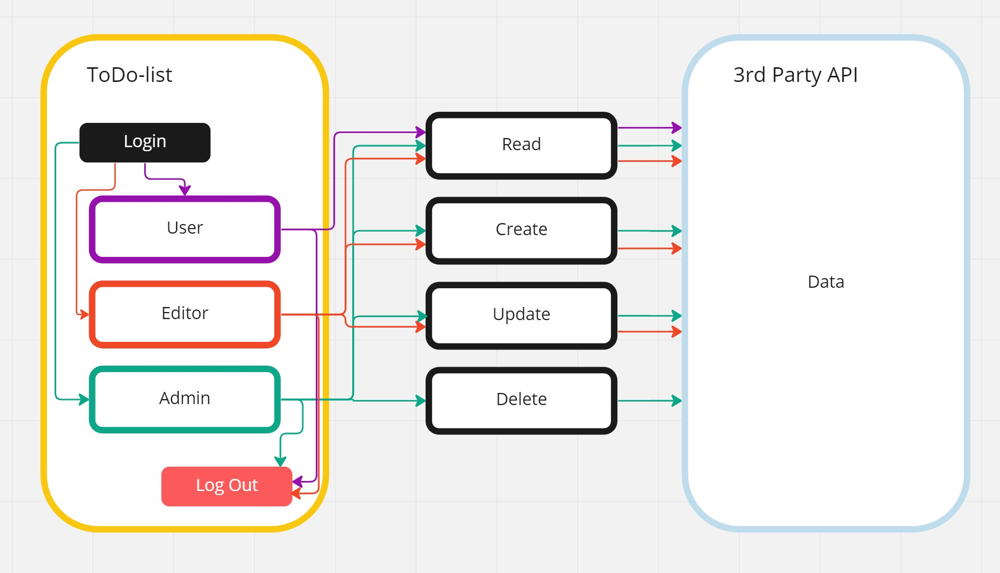
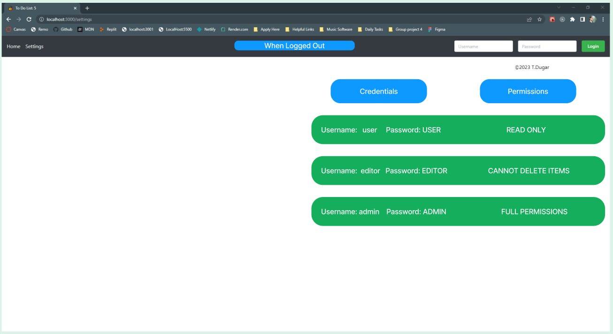
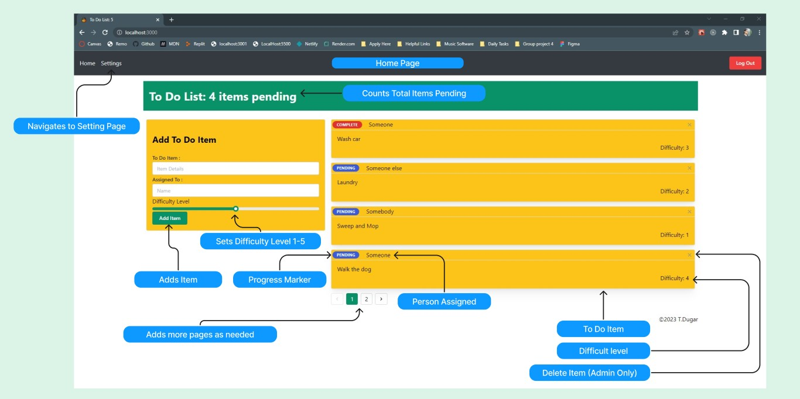
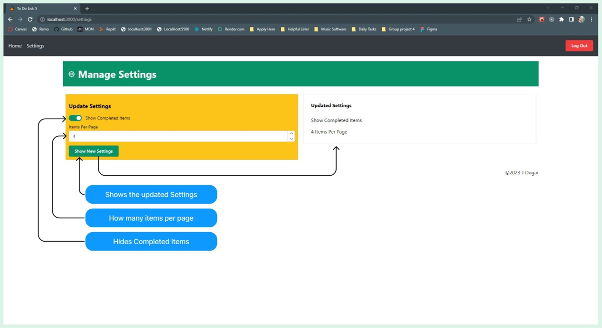

# todo-app

## Author: Trace Dugar

## Collaborators

- Hunter Fehr

## Description

This to do list app features Role based access controls, allowing Editors to Add, and update to dos. Admins can also do this along with deleteing the to do list items.
It has a settings page that allows the number of to do items displayed per page, the ability to hide completed to do items.

## Links and Resources

- [Github Repo](https://github.com/TraceDugar/todo-app)

- [Live Deployment](https://todo-app-traced.onrender.com)

### Running Applications

- `npm start`

- READ ONLY:      |         username: user   |    password: USER  |   Role: User ||

- READ, POST, UPDATE:  |    username: editor  |   password: EDITOR  |  Role: Editor ||

- READ, POST, ADD, DELETE: | username: admin   |   password: ADMIN  |   Role: Administrator ||

### Features and Routes

- Feature 1: Once a page has 3 items a new page is generated via Pagination.
- Feature 2: Add settings page.
- Feature 3: Add ability to control items per page in settings page.
- Feature 4: Heading on Homepage counts Total pending items.
- Feature 5: Add Show complete Todo Items switch in settings page.
- Feature 6: Implement Role Based Access Control.
- Feature 7: Toggle to do items Complete / Pending.
- Feature 8: Clickable X button to delete items from list as Admin.
- Feature 9: Connected to API.
- Feature 10: Add Cookies to persist login credentials.

#### Tests

- tests are ran with Jest
- tests list and app components

#### UML / Diagrams

## Role Base Access Control

## Login Page: Login Details displayed in green blocks here

## Home Page

## Settings Page Functionality

